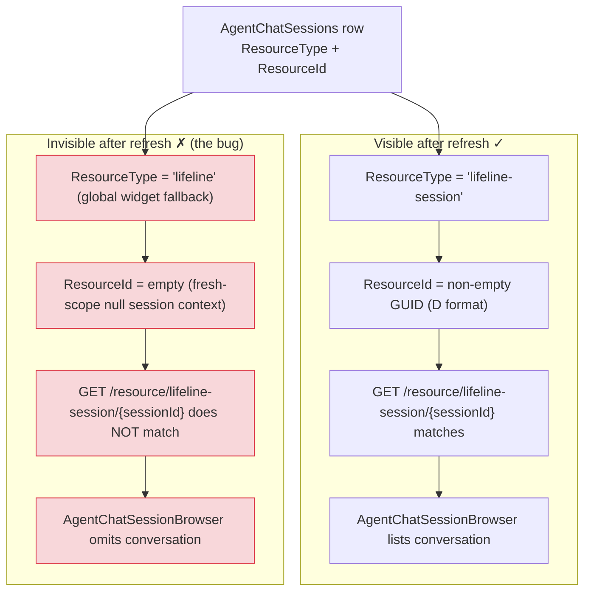

# Refresh Persistence — Reference

> Part of the [ab-chat-session-management](../SKILL.md) skill. For the 5-phase session lifecycle, see [session-lifecycle.md](../session-lifecycle.md). For hydration and session-browser UIs, see [frontend-hydration.md](../frontend-hydration.md). The end-to-end mechanism behind this symptom is the BFF-proxy rewrite path in [Fresh-scope context bridging](../../ab-conversation-store/references/fresh-scope-context-bridging.md) (ab-conversation-store).

> **When this applies:** a session-scoped conversation created from the browser Chat tab (not via an API body with explicit `ResourceType`/`ResourceId`) that disappears from the session browser after a page refresh. Use this reference when building session browser UIs, reasoning about refresh/rehydrate behavior, or wiring `AgentChatSurface` to a tenant BFF store that scopes conversations to a session resource.

## Refresh visibility invariant (D7)

A session-scoped conversation must survive a page refresh. The row's `ResourceType`/`ResourceId` pair decides everything: whether `GET /resource/lifeline-session/{sessionId}` matches, and therefore whether `AgentChatSessionBrowser` lists the conversation after refresh.

**Acceptance invariant:** a session-scoped conversation MUST survive a page refresh; `GET /resource/lifeline-session/{id}` is the authoritative visibility query. If the row is mislabeled (`lifeline` + empty `ResourceId`), the conversation is invisible even though its turns exist in the database.

## Where the rewrite path sits in the session lifecycle

The session lifecycle is Birth → Active → Pause/Resume → Dormancy → Death (see [session-lifecycle.md](../session-lifecycle.md)). The rewrite path touches two of those phases:

- **Active — tail of every turn.** `PersistDisplayedTurnAsync` → `RewriteConversationHistoryAsync` (`ClearSessionAsync` + re-`AppendTurnAsync` per turn + `SetUserIdAsync`) runs after every completed turn, but **outside** the agent execution scope. The scoped session context is no longer live, so the proxy's fresh-scope branch resolves `("lifeline","")` and re-creates the row mislabeled.
- **Pause/Resume — the page refresh.** A browser refresh is the classic Resume/rehydrate trigger: the UI re-reads history from the store to rebuild the timeline and the session browser. The refresh re-queries the **session-scoped** endpoint (`GET /resource/lifeline-session/{sessionId}`) through the listing path, which matches on `ResourceType` + `ResourceId` — not on content. A row mislabeled by the rewrite path fails that query and the conversation vanishes from `AgentChatSessionBrowser`.

The refresh does not corrupt anything — it merely re-queries using the authoritative session-scoped filter. The corruption happened earlier, at row (re)creation during the rewrite.

## The fix is the bridge, not the persistence layer

This symptom is the **observable cost of an incomplete bridge** — the persistence layer is not fragile. The BFF store persists every turn correctly; the row just carries the wrong resource context because the fresh scope had no session context to write. The canonical remediation is the capture → per-identity-cache → restore-fresh-scope bridge documented in [Fresh-scope context bridging](../../ab-conversation-store/references/fresh-scope-context-bridging.md) (ab-conversation-store), which restores `ILifelineSessionContext.CurrentSessionId` into the fresh scope when identity resolves (SSR/full-page refresh), so the rewrite re-creates the row with `ResourceType="lifeline-session"` and a non-empty `ResourceId`.

**Caveat (documented limitation):** the bridge seeds only when the fresh scope can resolve identity from `HttpContext` — present during SSR/full-page refresh, null inside the interactive SignalR circuit. On the interactive path the fresh scope deliberately does not seed (structured warning), so refresh persistence is guaranteed on the SSR path, not the interactive path.

## Key invariants

- A session-scoped conversation MUST survive a page refresh; `GET /resource/lifeline-session/{id}` is the authoritative visibility query.
- The row's `ResourceType`/`ResourceId` are written once at creation — the rewrite path (Clear + re-Append) can silently recreate a row with the wrong pair when session context is missing.
- The listing path queries the session-scoped endpoint directly; it never flows through the store proxy.
- The symptom is the observable cost of an incomplete bridge — restore the session context into fresh scopes, and refresh persistence follows.
