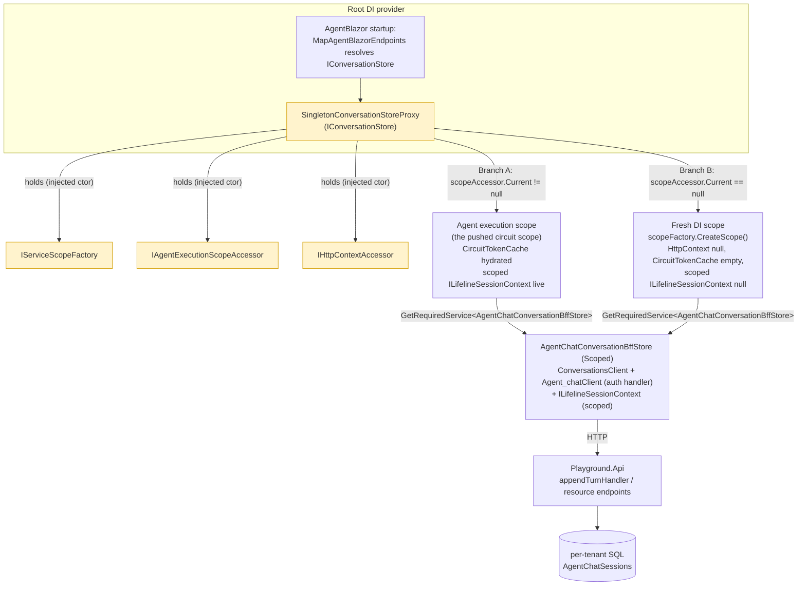
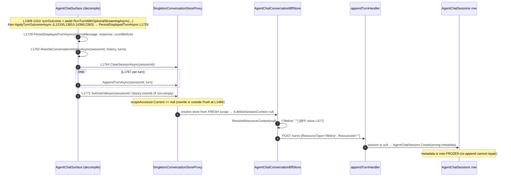
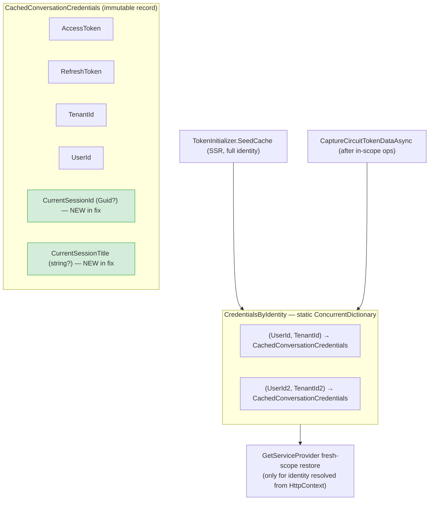

# Fresh-Scope Context Bridging

> **When this applies:** wiring a **Singleton** `IConversationStore` proxy over a **Scoped** BFF store (AgentBlazor resolves the store from the root provider), where store calls can land outside the agent execution scope. Use this reference when the store's writes depend on per-circuit/per-request context (`ICircuitTokenCache`, `ILifelineSessionContext`, tenant) that a fresh DI scope does not inherit, and for the BFF-proxy rewrite path that silently corrupts resource metadata when that context is missing.

## Contents

- [Why a singleton proxy over a scoped store (D8)](#why-a-singleton-proxy-over-a-scoped-store-d8)
- [The rewrite path end-to-end (D0 — anchor)](#the-rewrite-path-end-to-end-d0--anchor)
- [Two query paths (D1)](#two-query-paths-d1)
- [The bug sequence in line-numbered detail (D3)](#the-bug-sequence-in-line-numbered-detail-d3)
- [Remediation flow (D4)](#remediation-flow-d4)
- [Per-identity cache structure (D5)](#per-identity-cache-structure-d5)
- [Written rules](#written-rules)
- [Verdict: canonical pattern, not a hack](#verdict-canonical-pattern-not-a-hack)
- [Residual limitations](#residual-limitations)
- [Key invariants](#key-invariants)

Companion docs: the scope model behind the proxy's two branches is taught in [ab-middleware-authoring](../../ab-middleware-authoring/SKILL.md) (`references/scope-boundary-execution.md`); the refresh-visible symptom is taught in [ab-chat-session-management](../../ab-chat-session-management/SKILL.md) (`references/refresh-persistence.md`); the AsyncLocal generalization is taught in [ab-multitenancy](../../ab-multitenancy/SKILL.md) (`references/fresh-scope-context-bridging.md`).

## Why a singleton proxy over a scoped store (D8)

The prerequisite pattern. AgentBlazor resolves `IConversationStore` from the **root provider** at startup (`MapAgentBlazorEndpoints`) — a library contract: the store must be resolvable without an active scope. The real BFF store needs **scoped** dependencies (auth-handled HTTP clients, per-circuit `ILifelineSessionContext`), so a **Singleton proxy over a Scoped store** is the correct shape: the proxy is root-resolvable, and it creates/borrows the scoped store on demand.



- **Root-provider resolution is a library contract.** The proxy's ctor takes only root-resolvable services — `IServiceScopeFactory`, `IAgentExecutionScopeAccessor`, `IHttpContextAccessor` (store L53-57) — and creates the scoped store on demand via `GetServiceProvider` (L114).
- **The two resolution branches are the heart of the pattern.** Branch A (`scopeAccessor.Current != null`, L119-124) reuses the pushed circuit scope — full context. Branch B (L126-135) is a fresh `IServiceScopeFactory.CreateScope()` whose `HttpContext` is null, `CircuitTokenCache` is empty, and scoped `ILifelineSessionContext` is a brand-new instance with a null `CurrentSessionId` (store L19-23, L126-133).
- **Registration order matters.** AgentBlazor's own `TryAddSingleton` Null-fallback overrides a later Scoped/Transient registration — register proxies **before** `AddAgentBlazor()`. See the [BFF proxy-store wiring](../SKILL.md) section of this skill.

## The rewrite path end-to-end (D0 — anchor)

The conceptual sequence that ties the whole bug together. A browser-sent message on the session Chat tab appends correctly *inside* the execution scope, but the surface then rewrites the stored history *outside* it — and the rewrite's fresh-scope calls carry no session context, so the re-created row is mislabeled and invisible to the session-scoped query after refresh.

```mermaid
sequenceDiagram
    autonumber
    actor U as Elena (browser)
    participant S as AgentChatSurface<br/>(decompiled 0.2.22)
    participant A as Agent runtime
    participant P as SingletonConversationStoreProxy
    participant B as AgentChatConversationBffStore (Scoped)
    participant API as Playground.Api appendTurnHandler
    participant DB as per-tenant SQL

    U->>S: Send message on session Chat tab
    Note over S: SendAsync (L1234) → RunTurnWithOptionalStreamingAsync (L1484)<br/>INSIDE using(ExecutionScopeAccessor.Push(ServiceProvider))
    S->>A: RunTurnAsync (execution scope pushed)
    A->>S: StreamTurnOutcome
    Note over S: Push block DISPOSES here (L1484 using)
    S->>S: ApplyTurnOutcomeAsync (L1310, L1381, L1436, L2363) → PersistDisplayedTurnAsync (L1729)
    S->>S: RewriteConversationHistoryAsync (L1762):<br/>GetHistory → ClearSession → re-Append per turn → SetUserId
    Note over S: OUTSIDE execution scope → proxy takes fresh-scope branch
    S->>P: ClearSessionAsync(sessionId)
    P->>P: scopeAccessor.Current == null → CreateScope()
    P->>B: GetRequiredService&lt;AgentChatConversationBffStore&gt; (fresh scope)
    Note over B: fresh ILifelineSessionContext.CurrentSessionId == null
    B->>B: ResolveResourceContext(null) → ("lifeline", "")
    B->>API: POST /turns body{ResourceType="lifeline", ResourceId=""}
    API->>DB: session == null → create row (metadata frozen at creation)
    DB-->>API: row created with WRONG metadata
    S->>P: re-AppendTurnAsync per turn (same wrong metadata)
    Note over U,S: user refreshes page
    U->>B: GET /resource/lifeline-session/{sessionId}
    B->>API: resource-scoped query
    API-->>B: row NOT matched (ResourceType=lifeline, not lifeline-session)
    B-->>U: conversation missing from AgentChatSessionBrowser
```

## Two query paths (D1)

Full system context. There are **two** query paths and they are deliberately different: only the **append/rewrite path** flows through the proxy. The **listing path bypasses the proxy entirely** — `SessionDetailViewModel.LoadChatSessionsAsync` (SessionDetailViewModel.cs L213) calls the generated `ConversationsClient.ResourceAsync` directly (L225). Teaching the listing through the proxy would be wrong.

```mermaid
flowchart LR
    subgraph Browser[Browser]
        SURF[AgentChatSurface<br/>send / rewrite]
        BRW[AgentChatSessionBrowser<br/>listing]
    end

    subgraph Circuit[Blazor circuit]
        VM[SessionDetailViewModel<br/>LoadChatSessionsAsync]
        CLIENT[ConversationsClient.ResourceAsync<br/>(direct generated API client)]
    end

    subgraph DI[DI]
        PX[SingletonConversationStoreProxy]
        BFF[AgentChatConversationBffStore (Scoped)]
    end

    API[Playground.Api]
    DB[(per-tenant SQL)]

    SURF --> PX
    PX --> BFF
    BFF -->|append / rewrite path| API

    BRW --> VM
    VM --> CLIENT
    CLIENT -->|listing path — does NOT use the proxy| API
    API --> DB

    classDef proxy fill:#fff3cd,stroke:#d39e00;
    class PX,BFF proxy;
```

Because the listing path reads the same `AgentChatSessions` rows the append/rewrite path writes, a mislabeled row (wrong `ResourceType`/`ResourceId`) is invisible to the session-scoped listing even though the data exists.

## The bug sequence in line-numbered detail (D3)

A zoomed-in, line-referenced version of D0's failure, citing the decompiled surface (`AgentChatSurface.cs`, AgentBlazor 0.2.22) and the BFF store:



The ordering facts (verified against the decompile):

- `SendAsync` (L1234) is the surface's entry point — **not** `SendMessageAsync` (that method lives on `AgentChatBar.cs`, a separate component).
- `using (ExecutionScopeAccessor.Push(ServiceProvider))` (L1484) wraps **only** `RunTurnWithOptionalStreamingAsync` and closes at L1503.
- `ApplyTurnOutcomeAsync` has **four** call sites — L1310 (send), L1381 (inline handoff/retry), L1436 (approval), L2363 (resume) — and always runs after the push block disposes.
- `PersistDisplayedTurnAsync` (L1729) calls `RewriteConversationHistoryAsync` (call at L1753, declared L1762), which executes `ClearSessionAsync` (L1764) + per-turn `AppendTurnAsync` (L1767) + conditional `SetUserIdAsync` (L1771) — all outside the pushed scope.

## Remediation flow (D4)

The fix: **capture in scope → cache per identity → restore into the fresh scope**. After every successful agent-execution-scope operation, the proxy snapshots the circuit's tokens, tenant, user, and `ILifelineSessionContext.CurrentSessionId/Title` into a per-identity cache; when a fresh scope must be created later, it seeds that scope **only** for the identity it can resolve from `HttpContext` (SSR/full-page refresh — exactly the refresh scenario).

```mermaid
sequenceDiagram
    autonumber
    participant B as AgentChatConversationBffStore
    participant P as SingletonConversationStoreProxy
    participant C as CredentialsByIdentity (static ConcurrentDictionary)
    participant FS as Fresh scope (CreateScope)
    participant API as appendTurnHandler
    participant DB as AgentChatSessions row

    Note over B,P: After every successful agent-execution-scope call (scope == null in WithStoreAsync)
    B->>P: operation completes in execution scope
    P->>C: CaptureCircuitTokenDataAsync (store L262):<br/>snapshot AccessToken/RefreshToken/TenantId/UserId<br/>+ ILifelineSessionContext.CurrentSessionId/Title<br/>keyed by (UserId, TenantId)

    Note over P,FS: Later: rewrite path forces fresh scope
    P->>FS: GetServiceProvider (store L114): CreateScope()
    P->>P: ResolveCurrentIdentity() from HttpContext claims<br/>— ONLY present during SSR/full-page refresh (identity-resolution envelope)
    P->>C: TryGetValue((id.UserId, id.TenantId))
    alt identity matched + credentials cached
        P->>FS: seed ICircuitTokenCache (tokens + tenant)
        P->>FS: IF cached.CurrentSessionId != null:<br/>seed ILifelineSessionContext.CurrentSessionId/Title<br/>log "PROXY: Seeded fresh scope ILifelineSessionContext CurrentSessionId={SessionId}" (store L182)
        FS->>B: GetRequiredService&lt;AgentChatConversationBffStore&gt;
        B->>B: ResolveResourceContext(currentSessionId) → ("lifeline-session", guid)
        B->>API: POST /turns {ResourceType="lifeline-session", ResourceId=guid}
        API->>DB: row created with CORRECT metadata
    else identity unresolvable (interactive circuit, no HttpContext)
        P-->>FS: NO seed — log structured warning (documented limitation, store L44-51 / L195-199)
    end
```

## Per-identity cache structure (D5)

This extends — it does **not** re-teach — the per-identity cache isolation rules already in the skill's "Per-identity credential cache in Singleton stores" section (SKILL.md): per-identity `(UserId, TenantId)` keying, no cross-user statics, seed only the current identity. The diagram adds the two session-context fields the fix introduced:



- The snapshot record `CachedConversationCredentials` (store L70) carries `AccessToken`/`RefreshToken`/`TenantId`/`UserId` plus the new `CurrentSessionId`/`CurrentSessionTitle`.
- Seeded from two sources: `SeedCache` during SSR (store L372-380, full identity from `TokenInitializer`) and `CaptureCircuitTokenDataAsync` after in-scope operations (L262).
- Consumed by the fresh-scope restore in `GetServiceProvider` (L141-193) — tokens/tenant always when cached; session context **only when `cached.CurrentSessionId is not null`** (global-widget conversations stay `("lifeline","")`).
- Regression tests (`SingletonConversationStoreProxyTests`): `FreshScopeSeeding_CapturedSessionContext_IsRestoredInFreshScope`, `FreshScopeSeeding_NoSessionContextInCache_KeepsSessionContextNull`, `FreshScopeSeeding_CapturedSessionContext_IsScopedPerIdentity`, plus the isolation tests `FreshScopeSeeding_IdentityB_DoesNotUseIdentityATokens`, `FreshScopeSeeding_ResolvedIdentity_SeedsItsOwnTokens`, `FreshScopeSeeding_NoResolvableIdentity_SeedsNothing`, `FreshScopeSeeding_IdentityWithoutCachedCredentials_SeedsNothing`.

## Written rules

- **Capture-in-scope → cache-per-identity → restore-fresh-scope.** Capture the circuit context at the end of in-scope operations (`WithStoreAsync`, capture at L219/L241 when `scope is null`); restore it at fresh-scope creation, keyed by identity.
- **Only seed when identity matches AND session context is known.** The global widget (no session) must stay `("lifeline","")` — never invent a session-scoped resource for it.
- **Never rely on scoped context inside a fresh scope.** `HttpContext` is null, `CircuitTokenCache` is empty, `ILifelineSessionContext` has a null `CurrentSessionId` — the only correct source is the per-identity cache.
- **The server sets metadata only at row creation.** `appendTurnHandler` writes `ResourceType`/`ResourceId` inside `if (session is null)` (AgentChatModule.cs L162-171); the Clear-then-re-Append sequence deletes and recreates the row with the *then-current* body, so re-append cannot repair already-written metadata. This is exactly why the fresh-scope seeding matters.
- **Resolve resource context from the UI context that owns the conversation** — `ResolveResourceContext(Guid?)` (store L477-480): null → `("lifeline", "")`, non-null → `("lifeline-session", guid.ToString("D"))`. Constants at L456 (`lifeline-session`) and L466 (`lifeline`).

## Verdict: canonical pattern, not a hack

The BFF proxy + per-identity bridge is a **LEGITIMATE customization, not a hack**:

- The proxy shape is **required**, not optional — AgentBlazor resolves `IConversationStore` from the root provider, and the real store needs scoped dependencies. This is the standard way to satisfy a library's root-provider resolution contract.
- The per-identity cache is the **already-documented canonical seam** (this skill's "Per-identity credential cache in Singleton stores" section). The fix extends it with session context; it does not invent a workaround.
- The bug was an **incomplete bridge**, not a hacky design. The cache already captured tokens + tenant but silently omitted `ILifelineSessionContext`. **Incomplete-bridge rule:** every new scoped ambient context the store depends on (tokens, tenant, session, future fields) MUST be added to BOTH the capture (`CaptureCircuitTokenDataAsync` / `SeedCache`) AND the restore (`GetServiceProvider`), or the rewrite path silently drops the field.

## Residual limitations

- **Interactive-circuit fresh scopes are never seeded.** Inside the SignalR circuit there is no `HttpContext`, so `ResolveCurrentIdentity()` returns null and the proxy deliberately does NOT seed — it logs a structured warning instead of risking cross-user token reuse (store L44-51 class doc, L195-199 warning branch). The bridge guarantees correctness on the SSR/full-refresh path; interactive-circuit fresh-scope calls degrade to a warning. `FreshScopeSeeding_NoResolvableIdentity_SeedsNothing` locks this in.
- **Static-cache lifetime.** `CredentialsByIdentity` is process-lifetime state with no eviction policy. Fine for a single-app circuit count, but a future multi-instance or long-lived deployment should consider per-identity expiry.

## Key invariants

- `IConversationStore` resolves from the root provider; the Singleton proxy over the Scoped store is the only correct shape, and proxies must be registered before `AddAgentBlazor()`.
- The pushed execution scope covers only `RunTurnWithOptionalStreamingAsync`; everything after (persist, rewrite, UI lifecycle) runs in a fresh scope with empty scoped context.
- Capture in scope → cache per identity → restore into fresh scope; seed only the matched identity with a known session context.
- Resource metadata is written once at row creation; re-append cannot repair it — the fresh-scope bridge must carry the correct session context.
- Every scoped ambient context must be added to BOTH capture and restore, or the rewrite path silently drops it.
- The listing path never uses the proxy — it queries `ConversationsClient.ResourceAsync` directly.
