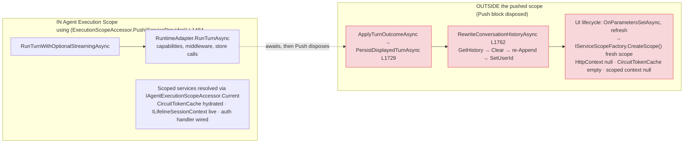

# Scope-Boundary Execution

> **When this applies:** any AgentBlazor customization that resolves **scoped services** from DI — typed middleware, store proxies, usage/audit recorders — and needs to know whether a live execution scope is present. Use this reference when code can run both inside an agent turn (pushed execution scope) and outside it (UI lifecycle, page refresh, conversation-store rewrite), and when deciding between `IAgentExecutionScopeAccessor.Current` and a scope-bridging cache.

## IN vs OUTSIDE the execution scope (D2)

The execution scope is created by `ExecutionScopeAccessor.Push(ServiceProvider)` and exposed to typed middleware and store proxies through `IAgentExecutionScopeAccessor.Current`. Everything the runtime does **inside** that `using` block sees live scoped services; everything that runs **after** the block disposes does not.

Line references are from the decompiled `AgentChatSurface.cs` (AgentBlazor 0.2.22): the `using (ExecutionScopeAccessor.Push(ServiceProvider))` opens at L1484 as the first statement of `RunTurnWithOptionalStreamingAsync` and closes at L1503. The surface's entry point is `SendAsync` (L1234) — **not** `SendMessageAsync` (that method lives on `AgentChatBar.cs`, a separate component).

## Rules

- **Typed middleware resolved via `IAgentExecutionScopeAccessor.Current` sees live scoped services.** Inside the pushed scope (`scopeAccessor.Current != null`), `GetRequiredService<T>` returns the circuit-scoped instance: hydrated `CircuitTokenCache`, live `ILifelineSessionContext`, auth-wired HTTP clients.
- **Anything that resolves a store/context OUTSIDE the pushed scope must use a scope-bridging cache — never ambient scoped state.** A fresh `IServiceScopeFactory.CreateScope()` has `HttpContext` null, an empty `CircuitTokenCache`, and a brand-new scoped context with null session id. Reading ambient scoped state there silently yields defaults (e.g. `("lifeline","")`), which is exactly how the conversation rewrite path corrupted resource metadata.
- **The pushed scope is per-turn, not per-lifecycle.** UI lifecycle methods (`OnParametersSetAsync`), page refreshes, and background work are outside it. Fall back to `IServiceScopeFactory` (with an explicit bridge) or skip, but never assume the execution scope is ambient.
- **Capture at the right moment.** Scoped context (tokens, tenant, session) must be snapshotted *while inside* the execution scope (or from the SSR-seeded identity) and restored explicitly into fresh scopes — see the capture → per-identity-cache → restore pattern.

## Where the boundary sits in the surface (D0 anchor)

The boundary is deliberately narrow. In the decompiled surface, the push wraps **only** `RunTurnWithOptionalStreamingAsync` (L1484–L1503) — both the non-streaming `RuntimeAdapter.RunTurnAsync` call and the streaming `ConsumeStreamingRunAsync` path. Everything after the turn returns runs outside it:

- `ApplyTurnOutcomeAsync` — four call sites (L1310, L1381, L1436, L2363), all after the push block.
- `PersistDisplayedTurnAsync` (L1729) → `RewriteConversationHistoryAsync` (L1762) — the store-rewrite path: `ClearSessionAsync` (L1764), re-`AppendTurnAsync` per turn (L1767), conditional `SetUserIdAsync` (L1771).
- UI lifecycle and refresh flows.

The full consequence of this narrow boundary — a singleton store proxy taking a fresh-scope branch with no session context and re-creating a mislabeled conversation row — is the BFF-proxy rewrite path, documented in [Fresh-scope context bridging](../../ab-conversation-store/references/fresh-scope-context-bridging.md) (ab-conversation-store).

## Related patterns

- **`IAgentExecutionScopeAccessor.Current`** — the singleton-safe accessor for resolving typed middleware and scoped services inside the pipeline (see this skill's [DI Resolution](../SKILL.md#di-resolution) section).
- **`IServiceScopeFactory` fallback** — used by `UsageRecordingMiddleware` for HTTP-endpoint paths where no circuit scope is pushed (see this skill's [Usage Recording](../SKILL.md#usage-recording) section). The same outside-the-scope rule applies: resolve a fresh scope, but never read ambient scoped state from it.
- **Scope-bridging cache** — the per-identity static cache (`CredentialsByIdentity` in the BFF proxy store) that carries tokens + tenant + session context across the fresh-scope boundary, seeded only for the identity resolvable from `HttpContext` (SSR/full-page refresh).

**Verdict framing (canonical, not a hack):** the scope-bridging cache is the FSH-sanctioned complement to `IAgentExecutionScopeAccessor` — inside the pushed scope use the accessor; across the boundary use the bridge. The BFF-proxy rewrite bug was an **incomplete bridge** (session context captured for tokens/tenant but not restored): every new scoped ambient context MUST be added to both the capture and the restore side of the bridge, or the outside-the-scope path silently drops it. Interactive-circuit fresh scopes (no `HttpContext`, unresolvable identity) are deliberately not seeded — a documented limitation, not a gap in the pattern.

## Key invariants

- `ExecutionScopeAccessor.Push` wraps only `RunTurnWithOptionalStreamingAsync`; everything after the turn returns runs outside the execution scope.
- Inside the scope, resolve scoped services via `IAgentExecutionScopeAccessor.Current`; outside it, use a scope-bridging cache — never ambient scoped state.
- A fresh DI scope has no `HttpContext`, no `CircuitTokenCache`, and a null scoped session context by default.
- Any new scoped ambient context must be captured inside the scope and restored into fresh scopes, or the outside-the-scope path silently drops it.
