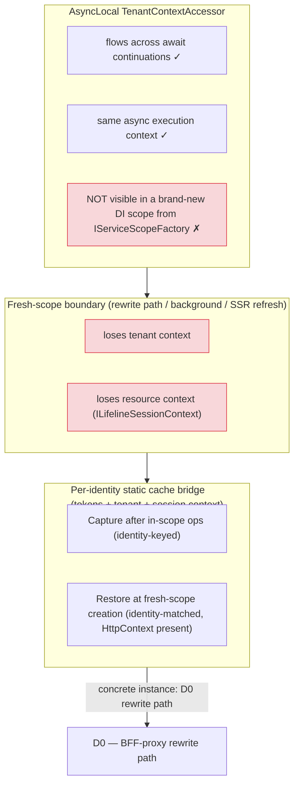

# Fresh-Scope Context Bridging (AsyncLocal vs CreateScope)

> **When this applies:** multi-tenant AgentBlazor deployments where tenant (and resource/session) context must survive a boundary that a new DI scope does not inherit — the conversation-store rewrite path, background work, or SSR refreshes. Use this reference when a singleton store or proxy depends on `TenantContextAccessor` (AsyncLocal) but can be invoked outside the execution scope that set it.

## The generalization (D6)

AsyncLocal-based context (the `TenantContextAccessor` pattern this skill teaches in Step 2) flows correctly across `await` continuations within one async execution context, but it is **not visible in a brand-new DI scope** created via `IServiceScopeFactory.CreateScope()`. Any code path that crosses the fresh-scope boundary loses both tenant context and resource/session context unless something bridges it.

## Why AsyncLocal does not cross CreateScope

- **AsyncLocal flows with the execution context**, not with DI. `TenantContextAccessor.TenantContext` set inside a circuit's pushed execution scope is visible on every `await` continuation in that same logical flow.
- **`IServiceScopeFactory.CreateScope()` builds a new scope from the root provider.** Nothing in that scope's construction reads your AsyncLocal — the scoped `ITenantContext`/tenant accessor starts empty, and `HttpContext` is null outside an HTTP request (interactive circuit, background work, SSR post-render).
- **The failure mode is silent.** Code that reads ambient scoped state in the fresh scope gets defaults (null tenant, `("lifeline","")` resource context) and writes wrong metadata — it does not throw.

## Concrete instance: the rewrite path (D0)

The conversation-store rewrite path is the concrete instance of this general rule. In AgentBlazor 0.2.22, `AgentChatSurface.SendAsync` runs the turn inside `using (ExecutionScopeAccessor.Push(ServiceProvider))`, but `PersistDisplayedTurnAsync` → `RewriteConversationHistoryAsync` (`ClearSessionAsync` + re-`AppendTurnAsync` + `SetUserIdAsync`) runs **after** the push block disposes. The singleton `SingletonConversationStoreProxy` then takes its fresh-scope branch (`IServiceScopeFactory.CreateScope()`), losing BOTH tenant-scoped and resource-scoped state:

- tenant context → `ICircuitTokenCache` empty, no tenant header/credentials,
- resource context → `ILifelineSessionContext.CurrentSessionId` null → `ResolveResourceContext(null)` → `("lifeline","")`,
- the re-created conversation row is mislabeled and invisible to the session-scoped query after refresh.

The complete sequence is the anchor diagram in [Fresh-scope context bridging](../../ab-conversation-store/references/fresh-scope-context-bridging.md) (ab-conversation-store) — D0 through D5, including the capture → per-identity-cache → restore remediation and the identity-resolution envelope (seed only when identity resolves from `HttpContext`; interactive circuits are deliberately not seeded).

## Canonical framing: bridge, not workaround

The proxy + per-identity bridge is the FSH-sanctioned way to carry tenant + resource context across the root-provider/fresh-scope boundary, **not a workaround**:

- AgentBlazor resolves `IConversationStore` from the **root provider**, so a singleton proxy over a scoped store is the required shape — there is no other way to satisfy the library contract.
- The AsyncLocal accessor remains the correct mechanism *inside* an execution scope; the per-identity cache is the sanctioned complement *across* scopes.
- This is the same pattern family as the `TenantAwareChatClient` proxy this skill teaches in Step 3 — a singleton that resolves per-context state on demand — extended with a capture/restore bridge.
- **Incomplete-bridge lesson:** every new scoped ambient context (tokens, tenant, session, future fields) MUST be added to both the capture and the restore side of the bridge, or it is silently dropped on the fresh-scope path.

## Key invariants

- AsyncLocal flows across `await` continuations but NOT across `IServiceScopeFactory.CreateScope()`.
- Fresh-scope code paths lose tenant AND resource context by default; the loss is silent.
- The per-identity static cache bridge (capture in scope → cache by `(UserId, TenantId)` → restore at fresh-scope creation) is the canonical remediation, not a hack.
- The rewrite path is the concrete instance; see the ab-conversation-store reference for the full sequence and the identity-resolution envelope.
