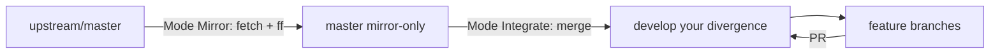

# Git Fork Sync

Keep a fork in sync with upstream while preserving your own divergence. Repo-agnostic: works from any repo root.

## Model

- **Mirror branch** (`master` by default): a clean copy of `upstream/<branch>`. Never receives local commits. Its sync is always a fast-forward.
- **Dev branch** (`develop` by default): your divergence. Receives upstream changes via merge.
- **Sync is manual.** Never set up scheduled automation unless asked.



## Run the sync

```powershell
# Refresh the mirror from upstream. Requires a clean working tree.
powershell -File scripts/sync-upstream.ps1 -Mode Mirror [-PushToOrigin]

# Merge the refreshed mirror into the dev branch. Stashes/restores local changes.
powershell -File scripts/sync-upstream.ps1 -Mode Integrate [-PushToOrigin]

# Preview any run without mutating the repository.
powershell -File scripts/sync-upstream.ps1 -Mode Mirror -DryRun
```

The script lives at `scripts/sync-upstream.ps1` inside this skill. One-time setup per repo: run once with `-UpstreamUrl <repo-url>` to create the `upstream` remote, or add it manually with `git remote add upstream <url>`.

## Guards

- **Mirror mode** refuses to run on a dirty tree. Commit or stash first; the mirror must stay pristine for fast-forward syncs.
- **Integrate mode** must run from the dev branch (`develop` by default). Uncommitted work is stashed with `-u` and restored before the divergence merge.
- **Never rebase anything already pushed to a remote others can see** — shared dev branches and PR targets are merge-only.
- A non-zero git exit code aborts the run and the script reports exactly where your stash is.

## On conflict

- **Integrate merge conflicts**: resolve in the working tree and commit. Your changes were restored *before* the merge, so conflict markers are the only artifact.
- **Stash pop conflicts**: resolve, then run `git stash drop` once clean.
- **Sync failed mid-flight**: the stash is still intact; restore with `git stash pop`.

## Parameters

| Parameter | Purpose | Default |
|---|---|---|
| `-UpstreamUrl` | Upstream repo URL (optional once the remote exists) | `""` |
| `-UpstreamRemote` | Upstream remote name | `upstream` |
| `-MirrorBranch` | Mirror branch | `master` |
| `-DevBranch` | Divergence branch | `develop` |
| `-Mode` | `Mirror` or `Integrate` | `Mirror` |
| `-PushToOrigin` | Push the resulting branch to origin | off |
| `-ForceWithLease` | Use `--force-with-lease` on push | off |
| `-DryRun` | Preview mutations, execute none | off |
| `-KeepStash` | Keep the auto-stash instead of popping | off |

## References

Read [references/fork-sync-strategy.md](references/fork-sync-strategy.md) when the user asks *why* this model, wants merge-vs-rebase guidance, or asks how to reduce divergence cost over time.

## Tests

Run with Pester 5.x (Pester 6 may fail to register `Should` operators on some machines):

```powershell
Import-Module Pester -RequiredVersion 5.6.1
Invoke-Pester -Path scripts/sync-upstream.Tests.ps1
```
