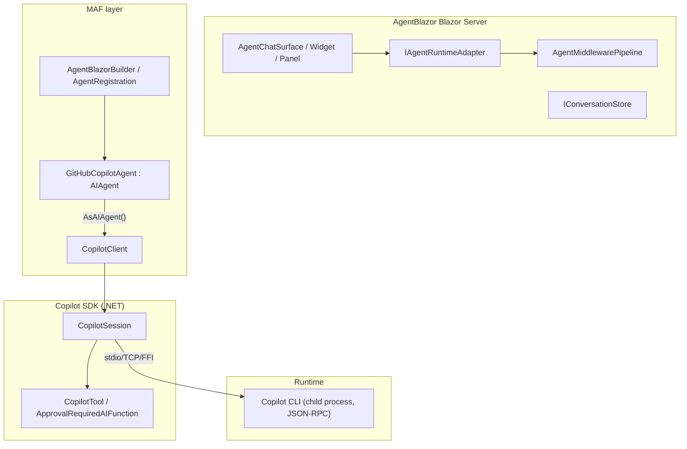

# Research Report: Integrating the GitHub Copilot SDK into AgentBlazor — Strategic Roadmap

**Date:** 2026-08-17
**Type:** Technical deep-dive + process/integration roadmap
**Repo under study:** github.com/arisng/AgentBlazor (MAF-based Blazor AI-agent framework)
**Research agents:** 8 parallel sync subagent dispatches across 2 iterations

---

## Executive Summary

The GitHub Copilot SDK for .NET (`GitHub.Copilot.SDK`, GA v1.0.11) is **not an `IChatClient`** — it is a self-contained agent runtime (JSON-RPC client over the bundled Copilot CLI child process) with its own tool-calling loop, sessions, permission hooks, MCP, streaming, and cost/cache telemetry. Microsoft ships an official MAF adapter, `Microsoft.Agents.AI.GitHub.Copilot` (GA 1.17.0), whose `GitHubCopilotAgent` implements the MAF `AIAgent`/`IAgent` interface via `copilotClient.AsAIAgent()`. Because AgentBlazor is MAF-based, the integration is a **new agent-mode IA­gent provider (not an `IChatClient`)**, requiring on-top customization in exactly four places: (1) wiring a Copilot `IAgent` through AgentBlazor's `IAgentRuntimeAdapter`, (2) honoring `[AgentAction(RequiresApproval)]` via the adapter's `ApprovalRequiredAIFunction` bridge (AgentBlazor's `CreateCapabilityTool` currently ignores the flag), (3) surfacing elicitation/`ask_user`/reasoning and a model picker (the MAF adapter does **not** map these to typed `AgentResponseUpdate`s), and (4) multi-tenant auth/token + process-lifecycle + packaging. **Caching is runtime-managed and automatic** (no `cache_control` flag) but AgentBlazor's existing "stable static prefix + dynamic tail + append-only history" KV-cache strategy is exactly right and drives `cacheReadTokens`.

**Bottom line:** No fork of MAF or the SDK is required, but a Copilot-specific `IAgentRuntimeAdapter`, a small approval-wrapping helper, an elicitation/reasoning event bridge, and a multi-tenant session/token lifecycle are required customization. The MAF 1.17.0 re-baseline already planned as roadmap Phase 1 is a prerequisite (pins `GitHub.Copilot.SDK [1.0.5,)` + MEAI 10.7.0 + `Microsoft.Agents.AI.Hosting 1.17.0-preview.260804.1`).

---

## Confidence Assessment

**Certain (verified from primary sources / code):**
- Package identities, versions, release dates, nuspec dependency floors (`GitHub.Copilot.SDK` 1.0.11; `Microsoft.Agents.AI.GitHub.Copilot` 1.17.0; `Microsoft.Agents.AI.Hosting` max `1.17.0-preview.260804.1`).
- The SDK is NOT an `IChatClient`; it is a JSON-RPC runtime with its own `CopilotClient`/`CopilotSession` ([nuspec deps][^nu1]; [dotnet README][^r1]).
- MAF adapter `AsAIAgent()` returns `GitHubCopilotAgent : AIAgent, IAsyncDisposable` ([CopilotClientExtensions.cs][^ex]; [GitHubCopilotAgent.cs][^ga]).
- Adapter event→update mapping and usage mapping verbatim ([GitHubCopilotAgent.cs][^ga]).
- Caching is automatic/observed, not configurable; `assistant.usage` exposes `cacheReadTokens`/`cacheWriteTokens`/`cacheExpiresAt` ([streaming-events.md][^se]; [usage-and-billing.md][^ub]).
- Two Copilot CLI CVEs (CVE-2026-29783, CVE-2026-45033) [advisories][^cve1][^cve2].
- AgentBlazor integration surfaces and the existing roadmap/docs convention (local checkout; [roast][^ctx]).

**Inferred (strong, but not line-verified or not empirically tested):**
- `ApprovalRequiredAIFunction` exists in `GitHub.Copilot.SDK` but its defining file/line is **not** indexed by GitHub code search; location unverified [^gap1].
- `AssistantUsageData` field names/types are inferred from the adapter's casts [^gap1].
- "Compaction invalidates the cache prefix" is a synthesis from `summaryContent`/`compactionTokensUsed` + KV-cache behavior; needs empirical validation around a compaction event [^gap3].
- SDK 1.0.11 vs the MAF-built 1.0.5 is **additive-only** and safe (no wire/type break), but not re-verified by MAF's own CI [^gap4].

**Assumptions:**
- Integration targets a Blazor Interactive Server (server-side) host with per-user OAuth (interactive) — the primary AgentBlazor hosting model.
- OpenAI-SDK / OpenAI-compatible / DeepSeek-first priority is honored; Copilot routing is treated as an additional provider mode, per the repo's existing OpenAI-first roadmap.

---

## 1. Architecture Overview

**Key structural fact:** the SDK spawns/bundles the Copilot CLI and owns the entire agentic loop (planning, tool invocation, file edits, context). MAF's adapter turns that into a standard `IAgent`; AgentBlazor's `IAgentRuntimeAdapter` is the seam that maps its own `AgentTurnRequest`/`AgentTurnResponse`/`AgentTurnStreamEvent` contract onto the `AIAgent`.[^r1][^mafdoc][^ctx2]

---

## 2. Key Repositories Summary

| Repo / package | Version (GA) | Role | URL |
|---|---|---|---|
| `github/copilot-sdk` → `GitHub.Copilot.SDK` | 1.0.11 (2026-08-14) | JSON-RPC client to Copilot CLI; own agent runtime | [nuget][^nu1] / [repo][^sdk] |
| `microsoft/agent-framework` → `Microsoft.Agents.AI.GitHub.Copilot` | 1.17.0 (2026-08-04) | MAF `AIAgent` adapter (`AsAIAgent`) | [nuget][^nu2] / [source][^adapter] |
| `microsoft/agent-framework` → `Microsoft.Agents.AI.Hosting` (+`.AGUI.AspNetCore`) | **1.17.0-preview.260804.1** (no stable 1.17.0) | DI/registration + AG-UI hosting glue | [nuget][^nu3] |
| `Microsoft.Extensions.AI(.Abstractions)` | 10.7.0 (floor) | `AIFunction` tool spec only — NOT `IChatClient` | MAF pins |
| AgentBlazor (local) | 0.2.x-internal.N | MAF-based Blazor agent framework | github.com/arisng/AgentBlazor |

Dependency chain: `Microsoft.Agents.AI.GitHub.Copilot → Microsoft.Agents.AI.Abstractions 1.17.0 + GitHub.Copilot.SDK [1.0.5,) + MEAI.Abstractions 10.7.0 + DI/Logging/STJ 10.0.9`.[^nu2]

---

## 3. Native Copilot SDK Feature Catalogue (maps to roadmap phases)

### 3.1 Stable / GA
Chat & sessions (multi-turn, follow-up, lifecycle events, steer/enqueue, abort, multiple concurrent sessions), streaming (`assistant.message_delta`/`reasoning_delta`), tools (custom `DefineTool`, allow/deny, permission `OnPermissionRequest`, `SkipPermission`, override, defer/lazy `toolSearch`, sub-agents/custom agents, `ask_user` via `OnUserInputRequest`), system-message customization (Append/Customize/Replace), hooks (`pre/post tool use`, `user_prompt_submitted`, lifecycle, error), persistent memory, sessions (create/resume/delete, session store), infinite sessions (auto-compaction), commands (slash), skills (`SkillDirectories`/`DisabledSkills`), auth (OAuth user, server-to-server, BYOK), model picker (`ListModelsAsync`), image input, citations (experimental), session limits/budget (`MaxAiCredits`), OpenTelemetry traces, remote/cloud sessions (Mission Control), plugins, fleet mode.[^f][^r1]

### 3.2 Least mature / experimental
MCP (called "evolving"), citations ("experimental, not covered by compatibility"), usage-metrics RPC/`contextInfo` (`GHCP001` diagnostic), FFI/in-process transport (`RuntimeConnection.ForInProcess()`), managed settings/`ManagedPermissions`, cloud sandbox agents.[^f]

**Feature → phase orientation (proposed):** Phase A hosts a basic Copilot agent-mode with tools/approval/streaming; Phase B adds auth+mulititenancy; Phase C adds elicitation/`ask_user`/reasoning + model picker (adapter gaps); Phase D adds MCP + skills + sub-agents; Phase E adds cost/cache observability + session limits; Phase F hardens (CVEs, sandbox, GA).[^f][^mafdoc]

---

## 4. Component Sections

### 4.1 The MAF Copilot Adapter (the integration bridge)

`CopilotClientExtensions.AsAIAgent(...)` returns a `GitHubCopilotAgent : AIAgent, IAsyncDisposable`.[^ex][^ga]
- **Constructor (session config):** `GitHubCopilotAgent(CopilotClient, SessionConfig?, ownsClient, id, name, description, jsonSerializerOptions, ILoggerFactory?)` — calls `ConfigureApprovalHook` on the config.[^ga]
- **Constructor (tools/instructions):** converts `tools` → `SessionConfig.Tools` (as `AIFunctionDeclaration`s) and `instructions` → `SystemMessageConfig { Mode = Append, Content = instructions }`.[^ga]
- **Run:** `RunCoreAsync` → `RunCoreStreamingAsync` → creates/resumes a `CopilotSession`, subscribes `On<SessionEvent>`, pushes mapped `AgentResponseUpdate`s through a `Channel`, then `SendAsync` and streams the channel.[^ga]
- **Session persistence:** `GitHubCopilotAgentSession` stores **only `SessionId`** (+ `StateBag`); rehydration is via `ResumeSessionAsync` keyed by that `SessionId` — the Copilot runtime owns message history, not MAF.[^ga2]
- **Disposal:** dispose the `CopilotClient` only `if (_ownsClient)`; otherwise only the per-session `CopilotSession`.[^ga]

**Event → MAF update mapping (verbatim switch):**[^ga]
`AssistantMessageDeltaEvent`→assistant `TextContent(DeltaContent)`; `AssistantMessageEvent`→assistant update (streaming vs raw); `ToolExecutionStartEvent`→`FunctionCallContent`; `ToolExecutionCompleteEvent`→`FunctionResultContent(ChatRole.Tool)`; `AssistantUsageEvent`→`UsageContent`; `SessionIdleEvent`→writes idle + `TryComplete()`; `SessionErrorEvent`→writes error + completes with `InvalidOperationException`; **all others**→generic `RawRepresentation` wrapper.

**Usage mapping (verbatim):**[^ga]
`UsageDetails.InputTokenCount = Data.InputTokens`; `OutputTokenCount = Data.OutputTokens`; `TotalTokenCount = Input+Output`; `CachedInputTokenCount = Data.CacheReadTokens`; `AdditionalCounts["CacheWriteTokens"] = Data.CacheWriteTokens`; `AdditionalCounts["Cost"] = (long)Data.Cost`; `AdditionalCounts["Duration"] = Data.Duration.TotalMilliseconds`.

**Adapter covers / does NOT cover:**

| Capability | Adapter | AgentBlazor must customize |
|---|---|---|
| Function tools | ✅ forwarded + invoked | Wire `[AgentAction]` `AITool`s into `SessionConfig.Tools` |
| Tool approval | ✅ auto `OnPreToolUse→"ask"→OnPermissionRequest` | Wrap approval-required tools in `ApprovalRequiredAIFunction` (its `CreateCapabilityTool` ignores `RequiresApproval`)[^ga][^ctx2] |
| Shell/file template + built-ins | ✅ `OnPermissionRequest` | Provide handler + decision UI |
| MCP servers | ✅ forwarded | Configure via `SessionConfig`; no adapter change |
| Custom agents / skills / infinite sessions | ✅ forwarded | none |
| System-message | ✅ forwarded | none |
| `ask_user` / elicitation | ⚠️ forwarded to SDK but NOT a typed update | **Must customize** — map to `ClarificationRequired`/`ApprovalRequired`; implement `OnUserInputRequest`/`OnElicitationRequest` |
| Model picker | ❌ not exposed on agent | **Must customize** — query at `CopilotClient`/`OnListModels` level |
| Reasoning streaming | ❌ not a typed update | **Must customize** — map to `Reasoning*` |
| `EnableSessionStore` | ✅ forwarded | Persist Copilot `SessionId` via `IConversationStore` |

**Resume-copy gap:** `CopyResumeSessionConfig` drops `Commands`, `OnElicitationRequest`/`OnExitPlanModeRequest`/`OnAutoModeSwitchRequest`, `EnableSessionStore`, `EnableSkills`, `SessionLimits`, `LargeOutput`, `ToolSearch`, managed settings, and client-level options on resume — AgentBlazor relying on resume must re-supply these or fork the adapter.[^ga]

### 4.2 Cost / KV-cache mechanics & alignment with AgentBlazor

**Caching is automatic, observed, not configurable.** No `prompt_cache`/`cache_control` flag anywhere in `SessionConfigBase`. The runtime reports via `assistant.usage`:[^se][^ub]
- `cacheReadTokens` ("Tokens read from prompt cache"), `cacheWriteTokens` ("Tokens written to prompt cache"), `cacheExpiresAt` (ISO timestamp when cache expires — **not settable**).
- `session.metadata.contextInfo` is "null until the session has been initialized (**the system prompt and tool metadata have been cached**)" — confirms the runtime caches static prefix.
- `models.list` exposes `billing.tokenPrices.cachePrice` per model.

**Compaction (InfiniteSessions):** `BackgroundCompactionThreshold` 0.80 / `BufferExhaustionThreshold` 0.95 (defaults); `session.compaction_complete` reports `pre/postCompactionTokens`, `summaryContent` (**LLM-generated summary**), `compactionTokensUsed { input, output, cachedInput }`. **Tension:** compaction *summarizes* history, changing the prefix and invalidating the KV-cache path (**inference, needs empirical check**). Mitigations: disable `InfiniteSessions` and own the budget, or keep history below compaction thresholds, or use `session.history.clearContext` for deliberate resets.[^ub][^ctx1]

**What AgentBlazor can/cannot control:**
- **Cannot control:** cache hit/miss, `cacheExpiresAt` TTL, exact KV-cache behavior, compaction summarization, AI-credit currency semantics.
- **Can control:** prefix stability (stable `SystemMessageMode.Append` content), append-only history budget (keep below compaction thresholds), compaction policy, model choice (favor low `cachePrice`), `SessionLimits.MaxAiCredits` budget gate, BYOK request-layer mutation (`CopilotRequestHandler`), and observability (subscribe `assistant.usage`/`usage.getMetrics`; SDK emits traces only, metrics are on AgentBlazor to build).[^ub][^gap6]

**Alignment with the existing roadmap:** AgentBlazor's KV-cache context-assembly strategy (stable static system prompt at prefix + dynamic `Runtime context:` at user-message tail + append-only history, verified in `ChatClientRuntimeAdapter.BuildUserMessage`) is **exactly** the right pattern to maximize `cacheReadTokens`. The Copilot integration inherits this; the sole new interaction is managing Copilot's own compaction so it doesn't rewrite the prefix.[^ctx1]

### 4.3 Version compatibility & packaging

- **SDK pin 1.0.11 safe** with `Microsoft.Agents.AI.GitHub.Copilot 1.17.0`: floor `[1.0.5,)`; 1.0.5→1.0.11 is additive-only (FFI transport, `toolSearch`, metadata, managed settings, citations, includes; protocol version `3` unchanged). No NU1107/downgrade conflicts with the Phase-1 graph (MEAI 10.7.0, DI 10.0.9).[^v1][^v2]
- **`copilot.exe` packaging:** the SDK packs MSBuild `build/*.targets` that download the CLI at build time and copy `runtimes/<rid>/native/copilot(.exe)` (+ FFI cdylib) to output. The MAF adapter ships a **`buildTransitive` bridge** so the binary flows through transitive references — critical for AgentBlazor where the SDK is only transitively referenced.[^v2]
- **Blazor server feasibility:** `--headless --no-auto-update` child process is valid for non-interactive web hosts; `COPILOT_HOME` set via `BaseDirectory`; `CopilotClientMode.Empty` sets `COPILOT_DISABLE_KEYTAR=1` (file-based creds scoped to `COPILOT_HOME`). Offline builds need `CopilotCliBinaryPath` or `CopilotSkipCliDownload=true` + pre-provisioned binary.[^v2]
- **Critical lifecycle asymmetry:** `Microsoft.Agents.AI.Hosting` / `.AGUI.AspNetCore` have **no stable 1.17.0** — only `1.17.0-preview.260804.1`. The Phase-1 MAF re-baseline must use those preview Hosting/AGUI packages; the Copilot adapter and core MAF are GA.[^v2][^v3]
- **Lifecycle:** one long-lived `CopilotClient` hosting many `CopilotSession`s (shared CLI process); per-session objects are disposed via `await using`; `ownsClient:true` chains `DisposeAsync`; graceful `StopAsync()`/`ForceStopAsync()`.[^v2]

### 4.4 Authentication & multi-tenancy

- **Per-user in Blazor server:** OAuth GitHub App → exchange code for user token → store server-side (your responsibility) → **set `SessionConfig.GitHubToken` per session** (client-level token priority, `UseLoggedInUser=false`). A **shared `CopilotClient` (`Mode=Empty`) + per-session token** is the documented multi-tenant pattern.[^a1]
- **Multi-tenancy mapping:** Copilot `mode:"empty"` ↔ AgentBlazor allowlist/`AgentPolicyDecision`; `SessionConfig.SessionId` ↔ `AgentConversationScope.BuildSessionKey` (`sessionId::agent::<name>` + optional `{tenantId}:` prefix); per-session `GitHubToken` ↔ per-user OAuth from AgentBlazor BFF token store; Copilot disk session-state ↔ per-tenant EF `ConversationSessionEntity` (AgentBlazor store = durable source of truth); `sessionFs`/`baseDirectory` ↔ per-tenant storage; `RuntimeConnection.ForUri` ↔ one headless `copilot.exe` server, clients over TCP.[^a1][^ctx2][^ctx3]
- **AsyncLocal caveat:** Copilot keeps identity at the **session** boundary (not AsyncLocal), partially neutralizing the "fresh-scope" problem — but the token-resolution step still runs inside `ExecutionScopeAccessor.Push`, so per-identity capture/restore bridging remains necessary before `CreateSessionAsync` in background/singleton paths.[^a1][^ctx3]
- **BYOK:** `Provider` is **per-session** → per-tenant LLM endpoints (OpenAI-compatible / DeepSeek / vLLM / Ollama) through Copilot as orchestrator, no Copilot seat required for the model call. `ProviderConfig` fields: `type` (openai/azure/anthropic), `baseUrl`, `apiKey`, `bearerToken`/`bearerTokenProvider`, `wireApi`. Azure Foundry supports **managed identity via `bearerTokenProvider`** (exceptions the "no managed identity" blanket claim); raw `apiKey` is key-based only. **Note:** BYOK disables session telemetry (no Copilot cache/cost accounting); BYOK cache/cost must be captured via the experimental `CopilotRequestHandler` or your own metrics. Licensing: BYOK requires **no Copilot subscription** (per FAQ/auth table), but this is empirically unverified for a fully token-free CLI launch — treat as an open gate.[^a1]
- **Server-to-server:** `ghs_` installation token + `copilot-requests:write` for headless CI/org-billed automation (via `COPILOT_GITHUB_TOKEN`). **Warning:** do NOT pass installation tokens through the SDK `gitHubToken` option.[^a1]

### 4.5 Security risk register

| # | Risk | L | I | Mitigation |
|---|---|---|---|---|
| R1 | Cross-tenant token leak via shared-runtime fallback | M | H | always set per-session `GitHubToken`, `UseLoggedInUser=false`, no shared env token, `mode:"empty"` |
| R2 | Child `copilot.exe` inherits account/service token | M | H | headless server, per-process `COPILOT_HOME`, least-privilege process, no shared embedded token |
| R3 | Prompt-injection → shell RCE bypassing approval (CVE-2026-29783, CLI < 0.0.423) | M | H | pin CLI ≥ patched; treat shell tools as high-risk in approval; `OnPreToolUse` filter |
| R4 | Malicious tenant repo → arbitrary command exec via git config (CVE-2026-45033, CLI < 1.0.43) | L-M | H | pin CLI ≥ 1.0.43; `mode:"empty"`; isolate tenant workspaces/`sessionFs`; sandbox CLI |
| R5 | Session-ID spoofing / unauthorized resume/delete | M | H | ownership check before `resumeSession`/`deleteSession` using embedded `::agent::` keys |
| R6 | OAuth token expiry/revocation & storage breach | M | H | app owns lifecycle; DPAPI/KeyVault/encrypted EF column; never in browser/circuit |
| R7 | Per-tenant BYOK key mishandling | M | M | resolve per-tenant `ProviderConfig` in proxy; don't log keys |
| R8 | Cross-tenant conversation-state confusion (Copilot store vs EF store) | M | M | align Copilot `SessionId` with `AgentConversationScope`; EF store is source of truth |
| R9 | BYOK runtime still reading a GitHub token at launch (unverified) | L | M | validate empirically (open gate) |
| R10 | Ambient `gh auth` fallback in multi-user server | M | M | `UseLoggedInUser=false` everywhere in server mode |

Sources for CVEs: [CVE-2026-29783][^cve1], [CVE-2026-45033][^cve2]; `github/copilot-sdk` has zero published advisories.

---

## 5. Proposed Strategic Roadmap (checkpoint-gated, incremental)

Aligned with the repo's existing docs skeleton (front matter: Created/Owner/Status/Last updated; sections Summary → Research References → Current State → Key Design → Rubber-Duck Review → Implementation Plan Phases → Release-Version Correlation → Recorded Decisions → Out of Scope → Security & Compatibility → Verification Plan → Relevant Files → Follow-up Status Tracker) and the `0.2.x-internal.N` version staging (`Directory.Build.props:9`).

**Phase 0 — Baseline & prerequisites (no new code).** Confirm Phase-1 MAF 1.17.0 re-baseline (`Microsoft.Agents.AI.Hosting[1.17.0-preview.260804.1]` + AG-UI rename + `AGUI.*` NuGet.Config + DI 10.0.9). Empirical gate 0: full solution builds 0 errors + `git status` clean + version-graph assertion.
**Phase 1 — Add the Copilot adapter packages (thin, no AgentBlazor code yet).** Add `Microsoft.Agents.AI.GitHub.Copilot 1.17.0` (+ explicit `GitHub.Copilot.SDK 1.0.11`), verify `copilot.exe` lands in demo output via the buildTransitive bridge. Gate 1: a console/probe project runs a `CopilotClient.AsAIAgent()` → `RunAsync` end-to-end with streaming + usage event.
**Phase 2 — Agent-mode IA­gent provider.** Implement `CopilotRuntimeAdapter : IAgentRuntimeAdapter` that wraps a resolved `AIAgent` (per `CreateSessionAsync`/`ResumeSessionAsync` via `ChatClientRuntimeAdapter.CreateAgentAsync` patterns), maps `AgentTurnRequest/Response` and stream events (ToolStart/Complete → `ToolCall*`, delta→`TextMessage*`, idle→`RunFinished`, error→`RunError`). Gate 2: AgentBlazor chat surface runs a Copilot agent turn with tool calls + approval UI, wire-audit of the adapter.
**Phase 3 — Approval + tools.** Honor `[AgentAction(RequiresApproval=true)]` by wrapping capability `AITool`s in `ApprovalRequiredAIFunction` (fix `CreateCapabilityTool`'s `_ = requiresApproval`), map `OnPermissionRequest` → AgentBlazor `PendingApprovals`/`AgentApprovalMode`. Gate 3: StepApproval/ExplicitPlanApproval UAT bucket passes.
**Phase 4 — Elicitation / reasoning / model picker (adapter gaps).** Bridge `ask_user`/`OnUserInputRequest`/`OnElicitationRequest` → `ClarificationRequired`; map `assistant.reasoning_delta` → `Reasoning*`; expose a model picker from `CopilotClient`/`OnListModels`. Gate 4: clarification + reasoning streamed in chat; model switch works.
**Phase 5 — Multi-tenancy & auth.** Shared `CopilotClient (Mode Empty)` + per-session `GitHubToken`/`ProviderConfig`; OAuth GitHub App token store in BFF; `AgentConversationScope`-keyed `SessionId`; per-tenant `sessionFs`/`baseDirectory`; fresh-scope bridging for token resolution. Gate 5: two-tenant isolated conversations test.
**Phase 6 — Cost/cache observability + budget.** Build metrics from `assistant.usage` (`CacheReadTokens`→`CachedInputTokenCount`, `CacheWriteTokens`/`Cost`/`Duration`→`AdditionalCounts`), `usage.getMetrics`, `session.usage_info`, compaction events; optional `SessionLimits.MaxAiCredits`. Gate 6: DeepSeek/OpenAI-compatible BYOK route + token budget audit (aligns with existing Phase 3/4 observability).
**Phase 7 — MCP + skills + sub-agents + hardening.** Configure `SessionConfig.McpServers`, `SkillDirectories`, `CustomAgents`; pin CLI ≥ 1.0.43; sandbox process; container/offline packaging. Gate 7: full UAT bucket + release checklist via `docs/internal/nuget-prerelease-checklist.md`.

**Release correlation:** Phases 0-1 → `0.2.x-internal.N` (internal fork builds, not public); Phase 2-4 → `0.3.0-preview.n`; Phase 5-7 → `0.3.0` GA. Each phase ends with an empirical checkpoint gate (Build / Wire-audit / Observability / UAT bucket / Live smoke / Docs) exactly as encoded in `.github/skills/roadmap-triage/references/checkpoint-gates.md`.

**Open gates to resolve before GA:** (a) empirically confirm `SDK 1.0.11` with MAF 1.17.0 build + CLI ≥ 1.0.43; (b) confirm BYOK fully token-free launch; (c) validate compaction↔cache-prefix interaction with `cacheReadTokens`; (d) confirm `ApprovalRequiredAIFunction` source/usage against the released package; (e) confirm per-tenant token resolution across the fresh-scope boundary.

---

## 6. Footnotes

[^r1]: github/copilot-sdk dotnet/README.md (architecture: app→SDK client→JSON-RPC→Copilot CLI; `CopilotClient`/`CopilotSession`/`SessionConfig`; streaming; permission; BYOK).
[^nu1]: https://www.nuget.org/packages/GitHub.Copilot.SDK (v1.0.11; deps MEAI.Abstractions 10.2.0).
[^nu2]: https://www.nuget.org/packages/Microsoft.Agents.AI.GitHub.Copilot (1.17.0; deps MAF.Abstractions 1.17.0, SDK [1.0.5,), MEAI 10.7.0, DI/Logging/STJ 10.0.9).
[^nu3]: https://www.nuget.org/packages/Microsoft.Agents.AI.Hosting (top 1.17.0-preview.260804.1 — no stable 1.17.0).
[^sdk]: https://github.com/github/copilot-sdk
[^adapter]: https://github.com/microsoft/agent-framework/tree/main/dotnet/src/Microsoft.Agents.AI.GitHub.Copilot
[^ex]: microsoft/agent-framework dotnet/src/Microsoft.Agents.AI.GitHub.Copilot/CopilotClientExtensions.cs (AsAIAgent overloads, lines 29-84; namespace GitHub.Copilot).
[^ga]: microsoft/agent-framework .../GitHubCopilotAgent.cs (ctor 76-140; session lifecycle 143-183; RunCore/Streaming 185-195; event switch 206-243; converters 349-455; ConfigureApprovalHook 510-573; CopyResumeSessionConfig 322-347; GetAdditionalCounts 474-508; DisposeAsync 303-311).
[^ga2]: microsoft/agent-framework .../GitHubCopilotAgentSession.cs (stores SessionId only; Serialize/Deserialize).
[^mafdoc]: github/copilot-sdk docs/integrations/microsoft-agent-framework.md (+ learn.microsoft.com/en-us/agent-framework/integrations/by-component/agent-services/github-copilot).
[^f]: github/copilot-sdk docs/features/README.md (agent-loop, streaming-events, custom-agents, skills, hooks, mcp, citations, usage-and-billing, session-limits, fleet-mode, remote/cloud sessions) + github/docs content/copilot.
[^se]: github/copilot-sdk docs/features/streaming-events.md (assistant.usage fields: cacheReadTokens "Tokens read from prompt cache", cacheWriteTokens, cacheExpiresAt; session.compaction_complete fields).
[^ub]: github/copilot-sdk docs/features/usage-and-billing.md (contextInfo null-until-cached; models.list cachePrice; getMetrics totalNanoAiu; compaction summaryContent/compactionTokensUsed; sessionLimits.maxAiCredits; BYOK no session telemetry).
[^v1]: NuGet catalog microsoft.agents.ai.github.copilot.1.17.0.json (SDK floor [1.0.5,)); SDK nuspec 1.0.5 vs 1.0.11 identical deps; sdk-protocol-version.json {"version":3}.
[^v2]: git/copilot-sdk dotnet/src/GitHub.Copilot.SDK.csproj + build/GitHub.Copilot.SDK.targets (RID, download, runtimes/<rid>/native); MAF adapter buildTransitive/{targets,props} bridge; Client.cs:2164-2301 (ProcessStartInfo, COPILOT_HOME/BaseDirectory, COPILOT_DISABLE_KEYTAR=1, --headless/--no-auto-update); MAF Directory.Packages.props (SDK pin 1.0.5).
[^v3]: microsoft/agent-framework dotnet/src/Microsoft.Agents.AI.GitHub.Copilot/Microsoft.Agents.AI.GitHub.Copilot.csproj (references Abstractions + SDK only; Hosting-agnostic).
[^a1]: github/copilot-sdk docs/setup/{multi-tenancy,github-oauth,backend-services,choosing-a-setup-path}.md, docs/auth/{authenticate,byok,azure-managed-identity,server-to-server-tokens}.md + dotnet/README.md.
[^cve1]: https://github.com/github/copilot-cli/security/advisories/GHSA-g8r9-g2v8-jv6f (CVE-2026-29783, CLI < 0.0.423, CWE-78).
[^cve2]: https://github.com/github/copilot-cli/security/advisories/GHSA-9ccr-r5hg-74gf (CVE-2026-45033, CLI < 1.0.43, CWE-696).
[^ctx1]: AgentBlazor docs/internal/roadmap.md (canonical; KV-cache context assembly design, phase structure, release correlation, verification playbook).
[^ctx2]: AgentBlazor src/AgentBlazor.Core/Runtime/Adapters/ChatClientRuntimeAdapter.cs (CreateAgentAsync 1020-1058, ResolveInstructions 2038-2121, BuildUserMessage 3028-3068, CreateCapabilityTool 1186-1202, WrapFunction/_ = requiresApproval 1265-1278, ExtractUsage 2199-2210, approval 545-743).
[^ctx3]: AgentBlazor .github/skills/ab-multitenancy/SKILL.md + references/fresh-scope-context-bridging.md (AsyncLocal does not cross CreateScope; TenantAwareChatClient proxy; per-tenant stores).
[^gap1]: ApprovalRequiredAIFunction defining file/line NOT indexed by GitHub code search; exists (adapter + Learn + csproj refs) — location unverified.
[^gap2]: AssistantUsageData exact declaration not line-cited (large generated file); field names/types inferred from adapter casts.
[^gap3]: "Compaction invalidates cache prefix" is inference from summaryContent/compactionTokensUsed + KV-cache behavior — needs empirical validation.
[^gap4]: SDK 1.0.11 vs MAF-built 1.0.5 is additive-only/SAFE but not re-verified by MAF CI — integration smoke test recommended.
[^gap6]: SDK OTLP emits traces only; cost/cache metrics must be built by AgentBlazor from assistant.usage/usage.getMetrics.
